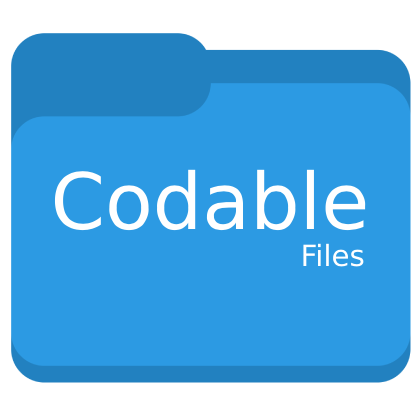

<p align="center">
    
</p>

<p align="center">
    
    <a href="https://cocoapods.org/pods/CodableFiles">
        
    </a>
    <a href="https://github.com/Carthage/Carthage">
        
    </a>
    <a href="https://swift.org/package-manager">
        
    </a>
</p>

Welcome to **CodableFiles**, a simple library that provides an easier way to save, load or delete Codable objects in Documents directory. It’s primarily aimed to save Encodable objects as json string and loads back from string to Decodable object. It's essentially a thin wrapper around the `FileManager` APIs that `Foundation` provides.

## Features

- [X] Modern, object-oriented API for accessing, reading and writing files.
- [X] Unified, simple `do, try, catch` error handling.
- [X] Easily to find and interact with saved files.
- [X] Unit test coverage over 75%.

## Examples

Codable object and constants for example purposes.
```swift
struct User: Codable {
    let name: String
    let lastName: String
}
let user = User(name: "First name", lastName: "Last name")
let users = [user]
let fileName = "Users"
```

CodableFiles shared reference.

```swift
let codableFiles = CodableFiles.shared
```

Save object in default directory.
```swift
try? codableFiles.save(user, withFilename: userFileName)
```

Load object from default directory.
```swift
let user: User = try? codableFiles.load(withFilename: fileName)
```

Load array of objects from default directory.
```swift
let users: [User] = try? codableFiles.load(withFilename: fileName)
```

Delete a file.
```swift
try? codableFiles.deleteFile(withFileName: fileName)
```

Delete default directory.
```swift
try? codableFiles.deleteDirectory()
```

Delete a directory.
```swift
try? codableFiles.deleteDirectory(directoryName: "CFFolder")
```

Copy a file with given name from Bundle to default documents directory.
```swift
let bundle = Bundle(for: type(of: self))
let pathURL = try codableFiles.copyFileFromBundle(bundle: bundle, fileName: fileName)
```

An example with recommended way to run the methods with do-catch pattern.
```swift
do {
    let savedPath = try codableFiles.copyFileFromBundle(fileName: fileName)
} catch {
    print("CodableFiles - Error: \(error.localizedDescription)")
}
```

### App bundle
AppBundle is Read-only, so you can not write anything to it programmatically. That's the reason we are using Documents Directory always to read & write data. Read more:
https://developer.apple.com/library/archive/documentation/FileManagement/Conceptual/FileSystemProgrammingGuide/FileSystemOverview/FileSystemOverview.html

## Installation

### CocoaPods

[CocoaPods](https://cocoapods.org) is a dependency manager for Cocoa projects. For usage and installation instructions, visit their website. To integrate CodableFiles into your Xcode project using CocoaPods, specify it in your `Podfile`:

```ruby
pod 'CodableFiles'
```

### Carthage

[Carthage](https://github.com/Carthage/Carthage) is a decentralized dependency manager that builds your dependencies and provides you with binary frameworks. To integrate CodableFiles into your Xcode project using Carthage, specify it in your `Cartfile`:

```ogdl
github "egzonpllana/CodableFiles"
```

### Swift Package Manager through Manifest File

The [Swift Package Manager](https://swift.org/package-manager/) is a tool for automating the distribution of Swift code and is integrated into the `swift` compiler.

Once you have your Swift package set up, adding CodableFiles as a dependency is as easy as adding it to the `dependencies` value of your `Package.swift`.

```swift
dependencies: [
    .package(url: "https://github.com/egzonpllana/CodableFiles.git", .upToNextMajor(from: "1.0.1"))
]
```

### Swift Package Manager through XCode
To add CodableFiles as a dependency to your Xcode project, select File > Swift Packages > Add Package Dependency and enter the repository URL
```ogdl
https://github.com/egzonpllana/CodableFiles.git
```

### As a file

Since all of CodableFiles is implemented within a single file, you can easily use it in any project by simply dragging the file `CodableFiles.swift` into your Xcode project.

## Backstory

So, why was this made? While I was working on a project to provide mocked URL sessions with dynamic JSON data, I found that we can have these data saved in a file in Document Directory or loaded from Bundle so later we can update, read or delete based on our app needs. The objects that have to be saved or loaded must conform to the Codable protocol. So, I made **Codable Files** that make it possible to work with JSON data quicker, in an expressive way.

## Questions or feedback?

Feel free to [open an issue](https://github.com/egzonpllana/CodableFiles/issues/new), or find me [@egzonpllana on LinkedIn](https://www.linkedin.com/in/egzon-pllana/).
